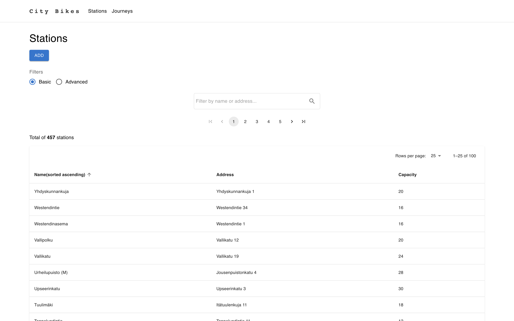

<h1 align="center">Welcome to City Bikes Application 👋</h1>

> This is the pre-assignment solution for Solita Dev Academy Finland 2023.

### ✨ [Running version on Heroku](https://citybikes.herokuapp.com/)

> \*Note: Heroku puts the app to sleep after 30 minutes of inactivity. This means
> that the app will take some time (about 5-10 seconds or more) to wake up again.

### ✨ [API Documentation](https://citybikes.herokuapp.com/api-docs)

## Frontend technologies

- React
- Redux
- Material UI

## Backend technologies

- Node.js
- Express.js
- Jest

## Database

- MongoDB Atlas

## Accomplishment

- All recommended and additional features have been implemented
- Endpoints and UI to store new journeys and stations
- Jest tests (backend level)
- Running version on Heroku
- API documentation (Swagger)

## How to run locally?

Clone City Bikes app to any IDE, such as VS Code.

> \*Note: .env files or used credentials are provided by email.

### To run the server side (backend):

Install backend dependencies:

```sh
npm install
```

In the root directory you need to create a file called ".env" in which you
will save database credentials and other server configurations. File content could be as
the following (replace username, password, cluster-name, and database-name with your own):

```sh
MONGODB_URI=mongodb+srv://<username>:<password>@<cluster-name>.6avck.mongodb.net/<database-name>?retryWrites=true&w=majority

PORT=3001
BASE_URI=http://localhost:3001
NODE_ENV=development

TEST_MONGODB_URI=mongodb+srv://<username>:<password>@<cluster-name>.6avck.mongodb.net/<database-name>?retryWrites=true&w=majority
```

Then run the server using:

```sh
npm run dev
```

You can also run backend integration tests using:

```sh
npm run test
```

### To run the client side (frontend):

Navigate to client directory:

```sh
cd client
```

Install frontend dependencies:

```sh
npm install
```

In client directory, you need to create a file called ".env" in which you
will save Google Maps API key and other configurations. File content could be as
the following (replace google-maps-api-key with your own):

```sh
# env variables must be prefixed with REACT_APP_
REACT_APP_GOOGLE_MAPS_API_KEY=<google-maps-api-key>
REACT_APP_BASE_API_URI=http://localhost:3001
```

Then run the app using:

```sh
npm start
```

### To run both backend & frontend with a single command:

Both frontend and backend have a script called "fullstack" to run the whole
application (server side & client side) using single command. </br></br>
After installing the application dependencies you can use the following command (either from the root directory or the client directory):

```sh
npm run fullstack
```

### Data Importing:

Journeys datasets and Stations dataset are imported into a remote MongoDB database.

> \*Note: Since MongoDB free tier has only 512 MB of storage, I imported only two Journey datasets (2021-05.csv and 2021-06.csv) in addition to stations dataset.

To run data importing locally (it will take some time):
- Download the datasets into your machine
- In the root directory create a folder called datasets
- Rename the relevant dataset files as 2021-05.csv, 2021-06.csv and bike-stations.csv.

Then import the data using:

```sh
npm run import-data
```

## Screenshots of the City Bikes App

### Stations


### Station Statistics


### Journeys


### Add New Journey


### API Documetation


## Author

👤 **Abdullah Hinnawi**

- [Portfolio](https://abdullahhinnawi.com/)
- [Linkedin](https://www.linkedin.com/in/abdullah-hinnawi-426465198/)
- [GitHub](https://github.com/abdullahHinnawi)

